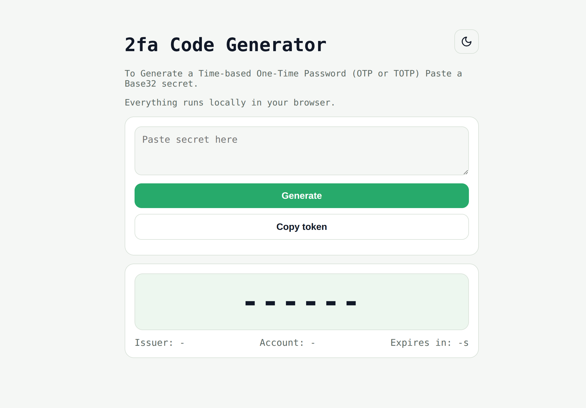

# Private-2FA

A lightweight offline TOTP authenticator focused on privacy and portability.

Supports Google Authenticator-compatible codes without cloud sync, accounts, telemetry, or internet access.

Everything runs locally in the browser.

---

## Why I built this

I wanted a 2FA tool that was truly private, light-weight and open source.

Most authenticators today push:
- cloud sync
- accounts
- telemetry
- unnecessary dependencies

Private-2FA is intentionally simple:
- offline-first
- self-hostable
- exportable
- privacy focused
- minimal

Paste a Base32 secret or `otpauth://` URI to generate TOTP codes directly in your browser.

No servers. No tracking.

---

## Features

- Offline TOTP generation
- Google Authenticator compatible
- Self-hostable
- Lightweight
- No telemetry
- No account required
- Minimal UI
- Dark / light mode

---

## Screenshot



---

## Install / Run

Clone the repository:

```bash
git clone https://github.com/tayloeofficial/private-2fa.git
